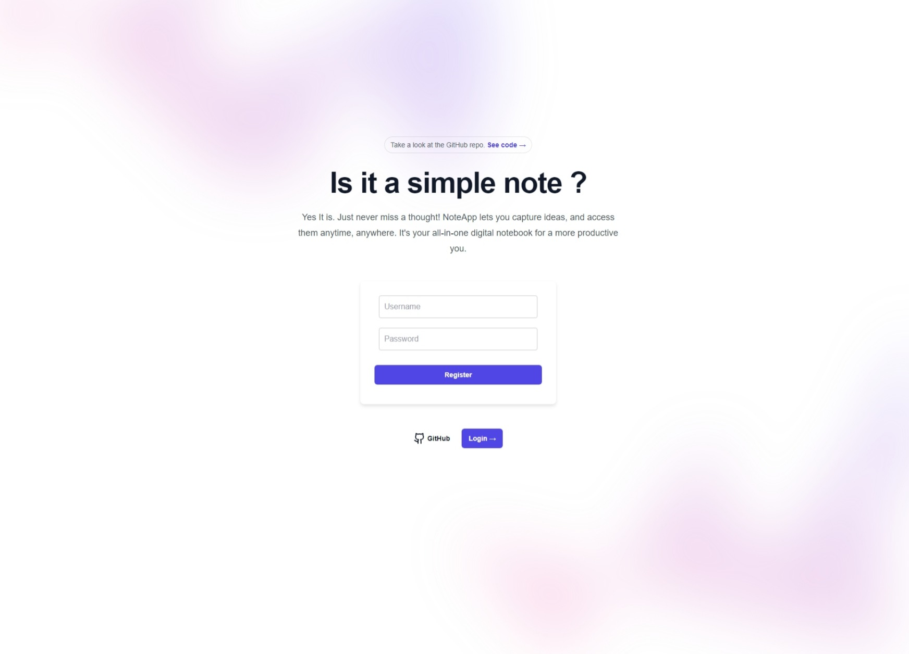
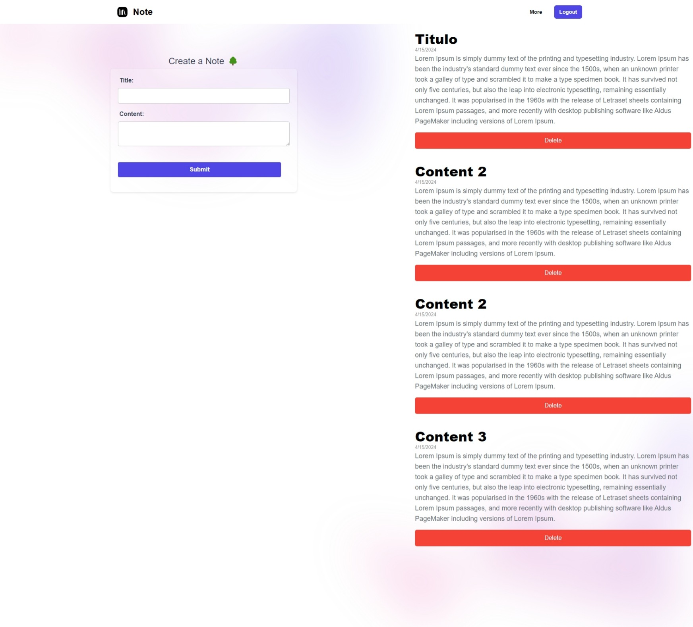

# Note app

## Literally a simple notes app 

## Features
- **Create Notes:** Users can easily create new notes.
- **View Notes:** Existing notes are displayed in an organized manner.
- **JWT Authentication:** Secure authentication of users using JSON Web Tokens (JWT).
- **React:** 
- **Axios:** Used Axios for efficient handling of HTTP requests.

## Installation & Configuration

### Backend (Django REST API)
1. Clone the repository : `git clone https://github.com/seuusuario/meusite.git`
2. Navigate to the backend project folder: `cd backend`
3. Install the virtual env if you need to: `python -m venv venv`
    4. Ativate it: `source venv/bin/activate` (Linux/Mac) or `venv\Scripts\activate` (Windows)
5. Install the dependencies: `pip install -r requirements.txt`
6. run the migrations: `python manage.py makemigrations`
7. make the migrations `python manage.py migrate`
8. run the server: `python manage.py runserver`

### Frontend (React w/ Axios)
1. go to frontend dir: `cd ../frontend`
2. Install the dependeces: `npm install` or `npm i`
3. run dev server: `npm run dev`

## Use
Now just open the browser and go to [http://localhost:5173/]

## login page

## regiter page

## home page

